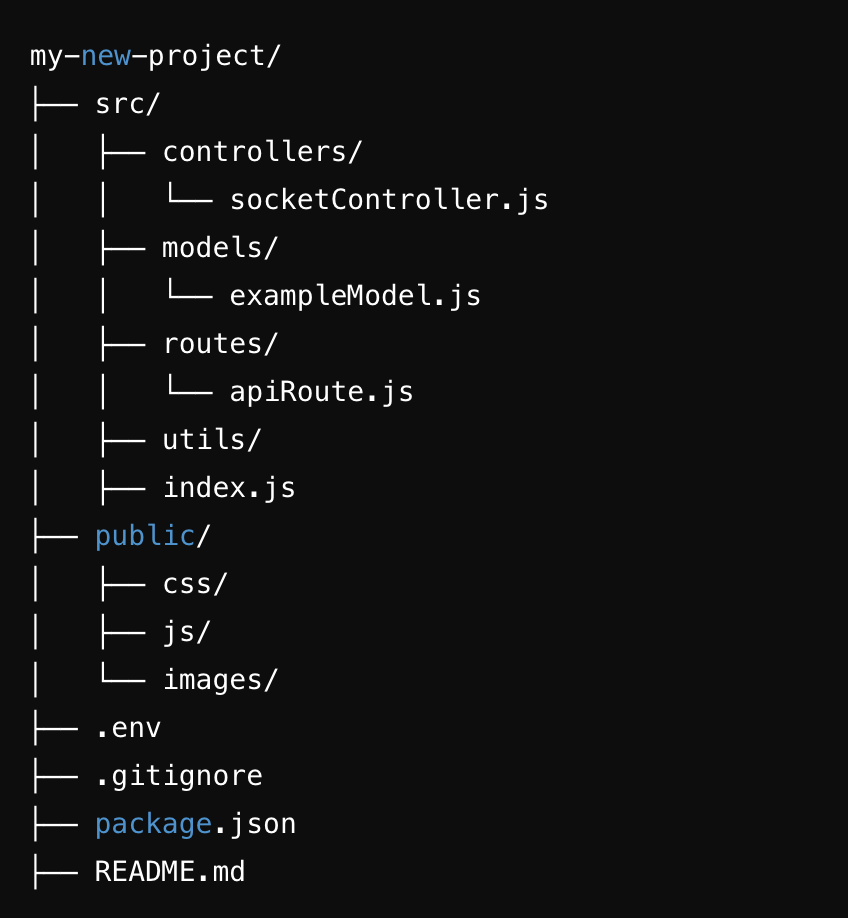

# node-project-folder

    NodeJS Project Setup CLI

1. [Description](#description)
   The NodeJS Project Setup CLI is a command-line tool designed to simplify the process of initializing and scaffolding a new Node.js project. It helps you save time by creating a complete, structured project with a professional folder layout, boilerplate code, and essential dependencies.

   No need to create server , servers are already created .all the packages are also preinstalled.
   Just Add your mongo username and password.

   open src/index.js

   ```bash
   auth: {
   username: '',
   password: '',
   }
   ```

and add port & dbDriver to the .env file.

```
port =
dbDriver =

```

2. [Features](#Features)
   Generates a ready-to-use Node.js project structure:
   Folders: src, controllers, models, routes, utils, public, etc.
   Files: .env, README.md, package.json, .gitignore, and more.
   Includes boilerplate code for:
   A basic Express.js server setup.
   Socket.io integration for real-time communication.
   Mongoose connection to MongoDB.
   Automatically installs essential dependencies like express, mongoose, socket.io, and dotenv.
   Adds customizable fields like project name and port in the .env file.
   Supports clean coding practices and modular architecture.
   Includes example routes, controllers, and models to kickstart development.

3. [Installation](#Installation)
   To install the CLI globally.

   ```bash
   npm install -g node-project-folder
   npx create-node-project my-new-project
   npm install
   npm start

   ```

4. [Default Folder Structured](#Structured)
   my-new-project
   # 


5. [.env](#env)

   add these to the .env file

| Option     | Description           | Default     |
| ---------- | --------------------- | ----------- |
| `port`     | Database port address | `localhost` |
| `dbDriver` | Database string       | `3306`      |


